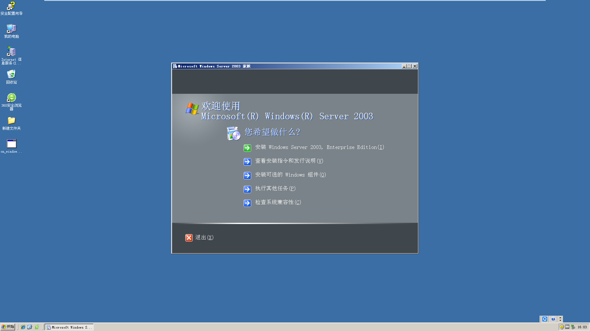

# Task-04
### 主要流程
## 1.虚拟机的安装与调试
+ 在网络上下载好VMware 虚拟机安装包，点击安装。
 安装完成后在网上查找激活码，打开虚拟机在此处键入

+ 打开虚拟机，进入全屏模式。按图所示打开设置然后在弹出的窗口中点击 *安装可选的 Windows 组件* 
+ 按照视频配置组件的详细信息，安装。调试 *internet 信息服务管理器* ，打开 *我的电脑* 创建新用户并设置属性。
## 2.网站的创建+
- 打开 *internet 信息服务管理器*创建网站设置 **IP 端口** 选择主目录路径为 *风讯5.0* 配置**网站权限**。
- 进入登陆界面用户名为admin，密码为123456 
- 设置系统参数，打开 **我的电脑/风讯5.0/Templets** 将里面的模板文件全部删除，并将自己写的工程文件复制进来。
## 3.模板&标签&样式
-  模板：使用Visual Studio Code将模板文件html编码改为GB2312，并在引用外部CSS链接&图片的HTML代码前加
**/Templets**
- 标签：创建所需要的标签，如**列表页通用标签·内容页通用标签·位置导航**等，然后插入到HTML对应位置
- 样式：创建新闻显示的样式（包含标题样式等），同时创建所需的时间显示样式（一般分为有日期列表和无日期列表）
## 4.新闻发布
- 点击 **栏目管理-创建跟栏目** 添加相应的栏目和模板地址。
- 点击 **新闻管理-添加新闻** 在对应位置填写标题，内容等，然后点击 **发布管理** 依次发布。
## 5.相关问题
1. 风讯自带的IE浏览器版本太低需要下载 *360* 或者 *IE8 for Windows Server 2003* 调试。
2. 遇到如图问题可以调整浏览器兼容模式再进行操作
3. 使用位置导航标签后，页面多出一个“位置导航”如图可以在FS_InterFace/MF_Public.asp
第73-77行把以下代码

```
    if trim(ns_domain)<>"" then
     ns_path = fg_str & ""
    else
     ns_path = fg_str & ""&ns_sitename&""
    end if
```
删去或者在代码前加 ’ ，如 ’if trim(ns_domain)<>"" then。
4. 在content.html中 内容块样式不用写字符大小间距等等等等，因为在新闻显示样式中已自动包含。
5. 当遇到无法在主机复制文件进入虚拟机时，可以按图示尝试解决

